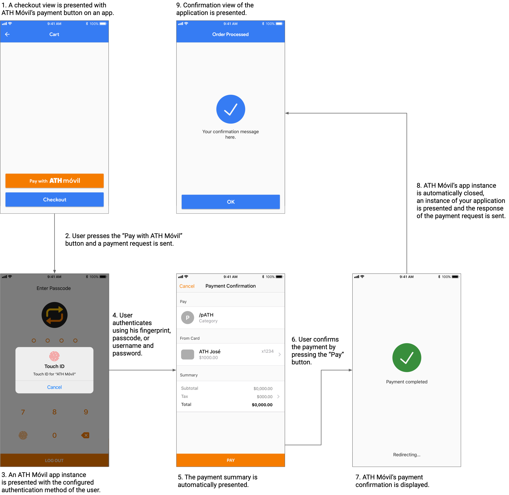

# ATH Móvil Payment Button - Xamarin SDK For Android/iOS


## Introduction
ATH Móvil's Payment Button SDK provides a simple, secure and fast checkout experience to customers paying on your iOS/Android application. After integrating our Payment Button on your app you will be able to receive real time payments from more than 1.5 million ATH Móvil users.

Disclaimer: The Payment Button ATH Móvil is not compatible with any major Ecommerce platform. This includes Shopify, Wix, Woocommerce or Stripe.

Disclaimer: We currently **do not** have a **Testing environment**. You need to have an active ATH Business account and a active ATH Móvil account.

## Prerequisites
Before using the ATH Móvil’s payment you need to have:

### ATH Business

1\. An active ATH Business account.

2\. A card registered in your ATH Business profile. 

3\. The public and private key assigned to your business.

For instructions on how to open a ATH Business account please refer to: [ATHB flyer eng letter 1.pdf](https://github.com/user-attachments/files/16267504/ATHB.flyer.eng.letter.1.pdf)

For more information related to ATH Business and how it works please refer to:[ATH BUSINESS_Apr2024.pptx](https://github.com/user-attachments/files/16267585/ATH.BUSINESS_Apr2024.pptx)

### ATH Móvil

To complete the payment for testing purposes you need to have:

1\. An active ATH Móvil account.

2\. A card registered in your ATH Móvil profile. It can not be the same card that is registered in ATH Business.

For more information related to ATH Móvil and how it works please refer to:[ATH Móvil_Apr2024.pptx](https://github.com/user-attachments/files/16267592/ATH.Movil_Apr2024.pptx)

## Support
If you need help signing up, adding a card or have any other question please refer to https://ath.business.com/preguntas. For technical support please complete the following form:  https://ath.business/botondepago.


## Installation

ATH Movil SDK works for Android and iOS so you can add it to your project as local Package Sources. This repository containts the compiled package so avoid compile the project. In order to do that you should follow the next steps:

* The new version of the xamarin SDK has been migrated to xamarin maui, which makes use of the net-6.0 libraries for android and ios.
* Into the repository find the file named **ATHMovil.PurchaseSDK** this file containts the compiled package of ATH Movil SKD. Download the file **ATHMovil.PurchaseSDK**.
* Open your project and navigate to Visual Studio > Preferences > NuGet > Sources, this option will show you the remote and local packages that are configured in your computer.
* Then click add button, the next window will required some information such as name, for the name you might set **ATHMovil SDK**, for the Location select the location of the file **ATHMovil.PurchaseSDK.1.0.0.nupkg**. After this the local source package has been configured and imported to Visual Studio.
* Now you should add the ATH Movil Package to your project as dependencie, in order to do that, in your project right click on dependencies and select Manage NutGet Packages, in the next window look for the option Package Source and select ATHMovil SDK, then you will see the package **ATHMovil.PurchaseSDK**.
* Select the option latest version and press the button Add Package.
* Now you must see the references of ATH Movil SDK in your project, it should be configured for Android or iOS then you can move to the next section Configuration.
* If you have more questions about how to configure the local source you can get more detail in this links <a href="https://docs.microsoft.com/en-us/nuget/consume-packages/install-use-packages-visual-studio?view=vsmac-2019#package-sources">for Windows Local Package</a> and <a href="https://docs.microsoft.com/en-us/visualstudio/mac/nuget-walkthrough?toc=%2Fnuget%2Ftoc.json&view=vsmac-2019#adding-package-sources">for Mac Adding Package Source</a>.

## Configuration

##### Android: Output data from your app

For Android X and above you should add the next configuration in your AndroidManifest.xml.
The bundle com.evertec.athmovil.android is required to open ATH Movil. 
The Access Network permission is requiered for the SDK.

```xml
	<manifest>
      <application....></application>
      <queries>
          <package android:name="com.evertec.athmovil.android" />
      </queries>
      <uses-permission android:name="android.permission.ACCESS_NETWORK_STATE" />
	</manifest>
```

##### Android: Input data to your app

The communication between your app and ATH Movil Applicaiton is through Intents and Activities. Then you must configure an Intent and Activity to handle the response. This is only for configuration, you won't receive the response in this configuration.

In the *AndroidManifest.xml* file, inside the Application Node add the configuration for your activity. You should define an **Activity Name** and **Action Name**. Please avoid to use the same Activity Name and Action Name as the example.

```xml
	<manifest>
      <application>
      <!-- here.set.your.bundleID means the name of bundle id of your app -->
      <!-- ActivityName should be a name for your activity 👇, please define your own activity name -->
      	<activity android:name="here.set.your.bundleID.ActivityName">
			<intent-filter>

			    <!-- ActionName should be a name for your intent 👇, please define your own action name -->
				<action android:name="here.set.your.bundleID.ActionName" />
				<category android:name="android.intent.category.DEFAULT" />
			</intent-filter>
		</activity>
      </application>
	</manifest>
```

Once you already define an **Activity Name** and **Action Name** the next step is configure the Activity class in the  your *MainActivity.cs*. This Activity should inherit from **PurchaseResponseActivity** and it is required that override OnCreated method and call base method. Remember this is only configuration avoid to handle the input response in the activity.

For example

```csharp

using ATHMovil.Purchase; /// 👈 Add the using in your file

namespace YourNameSpace
{
	public class MainActivity : global::Xamarin.Forms.Platform.Android.FormsAppCompatActivity
    {
    	.....
    }
    
    /// here.set.your.bundleID means the name of bundle id of your app
    /// ActivityName should be the name that you already define in the previous step
    ///                                           👇
    [Activity(Name = "here.set.your.bundleID.ActivityName")]
    public class ResponseActivity : PurchaseResponseActivity 
    {
    ///            👆
    /// Please define your own class name
        protected override void OnCreate(Bundle savedInstanceState)
        {
            base.OnCreate(savedInstanceState);
            
        }
    }
}
	
```

After this you can continue to Usage section.


##### iOS: Output data from your app

In your project for iOS open the *Info.plist* and add the following lines. This is a required pemission for open ATH Movil Application. You don't need to change anything.

```xml
	<plist version="1.0">
	<dict>
    	....
		<key>LSApplicationQueriesSchemes</key>
		<array>
			<string>athm</string>
		</array>
       ...
    </dict>
    </plist>
```
	

##### iOS: Input data to your app

In your proyect for iOS open the *Info.plist* and add the following configuration. 
For the key CFBundleURLName is going to be the bundle id of your app. 
For the key CFBundleURLSchemes you should define your own URL scheme


```xml
	<plist version="1.0">
	<dict>
        ...
		<key>CFBundleURLTypes</key>
		<array>
          <dict>
              <key>CFBundleTypeRole</key>
              <string>Editor</string>
              <key>CFBundleURLName</key>
			 <!-- 👇 Here set the bundle id of your app -->
              <string>here.set.your.bundleID</string>
              <key>CFBundleURLSchemes</key>
              <array>
	              <!-- 👇 Here define your own URL Scheme -->
                  <string>define-your-own-scheme</string>
              </array>
          </dict>
		</array>
    	...    
    </dict>
    </plist>
```

In the *AppDelegate.cs* file open it and add the following method OpenUrl(UIApplication app, NSUrl url, NSDictionary options). You don't need to change anything.

```csharp
using ATHMovil.Purchase.Model.Manager;  /// 👈 Add the using in your file

namespace TestApp.iOS
{
    .....   
    [Register("AppDelegate")]
    public partial class AppDelegate : global::Xamarin.Forms.Platform.iOS.FormsApplicationDelegate
    {
    
        .... 
        
		[Export("application:openURL:options:")]
        public override bool OpenUrl(UIApplication app, NSUrl url, NSDictionary options)
        {
            return PurchaseManager.tryComplete(new Uri(url.AbsoluteString));
        }
    }
}
	
```

After this you can continue to Usage section.


## Usage


In the SDK you can use the UI Button and payment logic for making payments to ATH Movil Application. 

##### Button UI

You can use the UI Button as any Button in Xamarin.Forms. This button has bindings for language and Theme. The button command event depends on you. This is an example:


```csharp

<ContentPage
    xmlns="http://xamarin.com/schemas/2014/forms"
    xmlns:x="http://schemas.microsoft.com/winfx/2009/xaml"
    xmlns:paymentButton="clr-namespace:ATHMovil.Purchase.UI;assembly=ATHMovil.PurchaseSDK">
     <!-- 👆 this is the xmlns of the SDK -->
    
    <ContentPage.Content>
    	<paymentButton:ATHMButton
                Command="{Binding OnPayATHMovil}" <!-- 👈 Here the command of your view model -->
                Language="English" <!-- 👈 You can define the language of the button English, Spanish or Default by device -->
                Theme="Classic" <!-- 👈 You can define the theme of the button Classic, Light or Dark -->
                />
                
	</ContentPage.Content>
</ContentPage>
	
```

| Theme  | Example |
| ------------- |-------------|
| Classic |  |
| Light |  |
| Dark |  |


##### Using Payment Logic

Before continue open the codebehind of the App.xml class, add the following method. This method is important for notify the
payment status when ATH Movil Application doesn't response as expected.

```csharp
protected override void OnResume()
{
    PurchaseManager.OnResume();
}
```

In the command of your view model you can add the logic to send the payment to ATH Movil Application. This example shows all required fields.


```csharp
OnPayATHMovil = new Command(() =>
            { 
                Business publicToken = new Business(“here set your public token or dummy word for testing”);
                UriCallBack callback = new UriCallBack("here your URL Scheme or Action Name");
                String NewFlow = “Yes”;
                
                Purchase purchase = new Purchase(1.0)
                {
                    SubTotal = 0.0,
                    Tax = 0.0,
                    Metadata1 = ””,
                    Metadata2 = ””,
                    Items = List<Item>()
                    PhoneNumber = “”
                };

                PurchaseHandler handler = new(OnResponseCompleted, OnResponseCancelled, OnResponseExpired, OnException);

                PurchaseRequest request = new(purchase, publicToken, callback, NewFlow);
                request.Pay(handler, global.Timeout);
            });
/// In PurchaseRequest, the NewFlow field refers to the new payment method. this field can be a String YES or NO
/// 👆 After Pay method your application would open ATH Movil Personal. 
/// This method is overloaded you can send a timeout, by default is 600 seconds (ten minutes)


```

| Object  | Value |
| ------------- |-------------|
| Business | Defines your business token. Also you can use the **dummy** word for testing, see section Testing |
| UriCallBack | Defines the call back for your app, the value should be the Action Name for Android and URL Scheme for iOS. You can define the same value for Action Name and URL Scheme |
| Purchase | Defines the purchase total, this is the amount that ATH Movil Application will withdraw of the user. |
| PurchaseHandler | In this object you define the methods or callback, those methods will receive the response object from the payment. You would receive completed, cancelled, failed  or expired payment. If you received OnException means a error in the SDK or invalid input valid |
| PurchaseRequest | In this object you establish if you want to use the new payment version by a string stating YES or NO |


The following optional properties can be used to add additional information to the payment:

```csharp
      ...
      Purchase purchase = new Purchase(global.ATHMPayment.Total)
      {
      		SubTotal = 1.0,
            Tax = 1.0,
            Metadata1 = "",
            Metadata2 = "",
            Items = List<Item>(),
            PhoneNumber = “”
	  };
      ...
```

  | Variable  | Data Type | Required | Description |
  | ------------- |:-------------:|:-----:| ------------- |
  | `Subtotal` | double | No | Optional  variable to display the payment subtotal (if applicable) |
  | `Tax` | double | No | Optional variable to display the payment tax (if applicable). |
  | `Metadata1` | string | No | Optional variable to attach data to the payment object. Max length 40 characters. |
  | `Metadata2` | string | No | Optional variable to attach data to the payment object. Max length 40 characters. |
  | `Items` | List<PurchaseItem> | No | Optional variable to display the items that the user is purchasing on ATH Móvil's payment summary screen. |
  | `PhoneNumber` | String | No | Optional variable to send the customer's phone number. |

**Items Array**

For items properties there is a class named PurchaseItem, you can use it to fill the array item. The following table describes the values for each item property.

  | Variable  | Data Type | Required | Description |
  | ------------- |:-------------:|:-----:| ------------- |
  | `Name` | string | Yes | Name of item. |
  | `Price` | double | Yes | Price of individual item. |
  | `Quantity` | int | Yes | Quantity of individual item. |
  | `Description` | string | No | Brief description of the item. |
  | `Metadata` | string | No | Optional variable to attach data to the item object. |
  
  
As you notice in the PurchaseHandler you set a methods of your view model. Those methods are receiving a parameter of  PurchaseResponse type. The following table describe the properties for this object.

##### Using Payment Logic for Response

`PurchaseHandler` will now receive an object with the type `PurchaseResponse`. Depending on the output of the transaction the methods or closure `onCompleted`, `onExpired` or `onCancelled` will be automatically called. You will receive an object with the payment information as follows:

```csharp
/// Payment data initially configured on the request.
response.Purchase.Total
response.Purchase.Subtotal
response.Purchase.Tax
response.Purchase.Fee
response.Purchase.MetAmount
response.Purchase.Metadata1
response.Purchase.Metadata2

/// Items data initially configured on the request.
PurchaseItem purchaseItem = response.Purchase.Items[0]
purchaseItem.Name
purchaseItem.Price
purchaseItem.Quantity
purchaseItem.Description
purchaseItem.Metadata

/// Transaction information.
response.Info.DailyTransactionID /// Sequential number of the transaction
response.Info.ReferenceNumber /// Unique idenfier of the transaction
response.Info.TransactionDate /// Date of the transaction

/// ATH Móvil user information.
response.User.Name /// Customer name
response.User.Telephone /// Customer telephone number in format (xxx) xxx-xxxx
response.User.Email /// Customer email

```
| Variable  | Data Type | Description |
| ------------- |:-------------:|------------- |
| `DailyTransactionID` | Int | Daily ID of the transaction. If the transaction was cancelled o expired value will be 0. |
| `ReferenceNumber` | String | Unique transaction identifier. If the transaction was cancelled o expired value will be an empty string. |
| `date` | Date | Date of the transaction. Puerto Rico's time (GMT-4). |
| `User.Name` | String | Name registered on ATH Móvil of user that paid for the transaction. It might be empty if ATH Movil Application won't complete the payment. |
| `response.User.Telephone` | String | Phone number registered on ATH Móvil of user that paid for the transaction. It might be empty if ATH Movil Application won't complete the payment. |
| `response.User.Email` | String | Email address registered on ATH Móvil of user that paid for the transaction. It might be empty if ATH Movil Application won't complete the payment. |

* *Note: `response.Purchase` and `response.Purchase.Items` are the same objects that were received on the request. Values and data types will be identical.*

If unexpected data is sent on the request of the payment the SDK will call the closure or method `onException` and you will receive an object with the type `PurchaseError`. Your application must be able to handle these exceptions. You can view the cause of the exception using the following sample code:

```csharp

	error.FailureReason ///Description of the error.
    error.Description ///"Error in request" or "Error in response".
    error.IsRequestError ///True if the error is in input data.
```

If the new payment flow has been chosen, the Authorization service must be consumed after receiving the successful response from the ATH Móvil app. To do the above, you need to implement the following code:

```csharp

private async void getServiceAuthorization(PurchaseResponse response) {

    this.response = response;

    await Task.Delay(1000);

    if (Global.Instance().Flow.Equals("Yes") && !Global.Instance().Token.ToLower().Equals("dummy"))
    {
        AuthorizationServices service = new AuthorizationServices();
        AuthorizationResponse authorizationObject = await service.AuthorizationServicesCall();
        if (authorizationObject != null)
        {
            response.Info.DailyTransactionID = int.Parse(authorizationObject.Data.DailyTransactionId);
            response.Info.ReferenceNumber = authorizationObject.Data.ReferenceNumber;
            response.Purchase.NetAmount = authorizationObject.Data.NetAmount;
            response.Purchase.Fee = authorizationObject.Data.Fee;
        }
        else {
            response.Info.Status = PurchaseState.failed;
        }

        _ = ShowConfirmationPageAsync(response);
    }
    else {
        _ = ShowConfirmationPageAsync(response);
    }
}

```

## Testing

You could test the integration with ATH Movil Personal Application so you can use your public token or set the public as "dummy".
Setting public token as "dummy"  ATH Movil Personal Application will simulate a payment, in that way you can test all the features such as
completed, expired or cancelled payments. You need the latest version of ATH Movil Personal Application. If you want to test OnException case you might send a negative total in Purchase or invalid timeout.

```csharp
	Business publicToken = "dummy";
```


## User experience


## Legal
The use of this API and any related documentation is governed by and must be used in accordance with the Terms and Conditions of Use of ATH Móvi Business ®, which may be found at: https://athmovilbusiness.com/terminos.
